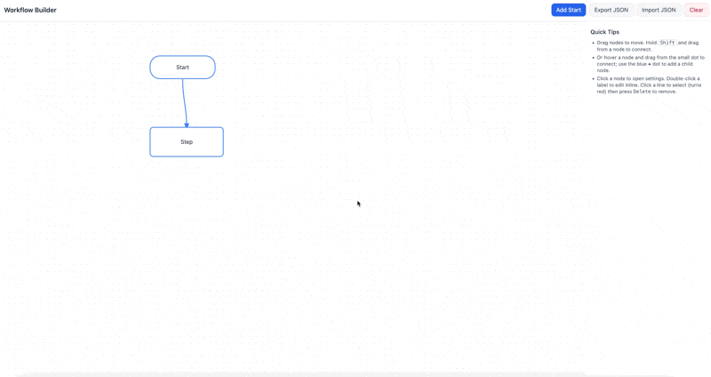

<p align="center">
  <a href="https://github.com/stephen-costa20/workflow-builder"></a>
  <a href="https://github.com/stephen-costa20/workflow-builder/blob/main/LICENSE"></a>
  <a href="https://github.com/stephen-costa20/workflow-builder/commits/main"></a>
  
</p>


# Interactive Workflow Builder

A fully client-side, interactive workflow builder built with **HTML, SVG, Tailwind CSS, and vanilla JavaScript**.
This project allows users to visually design workflows using draggable nodes and connectors, configure node properties, attach files, and export/import workflows as JSON — all **without a backend**.

The entire application runs in the browser from a single HTML file.


## Preview




## Features

### Visual Workflow Canvas
- Drag-and-drop workflow editor using SVG
- Multiple node types (process, decision, terminator, document, database, etc.)
- Click-and-drag connectors to define flow relationships
- Self-loops and duplicate-edge protection
- Pan and zoom support for large workflows

### Node Configuration
- Inline label editing
- Node settings panel with:
  - label
  - shape/type
  - fill and stroke colors
  - free-form details/notes
- Duplicate or delete nodes directly from the UI

### File Attachments
- Attach files directly to individual nodes
- Small files are embedded and persisted
- Larger files are session-only (object URLs)
- Attached files can be opened or removed per node

### Persistence & Export
- Automatic persistence using `localStorage`
- Export entire workflow (nodes, edges, view state) as JSON
- Import workflows from JSON files
- Clear/reset canvas with confirmation

### Keyboard & Interaction Support
- Shift-drag to connect nodes
- Delete/backspace to remove selected edges
- Inline editing with keyboard shortcuts
- Hover-based UI controls for visual cleanliness


## Tech Stack

- HTML
- SVG
- Tailwind CSS (CDN)
- Vanilla JavaScript
- Browser APIs:
  - localStorage
  - FileReader
  - Blob
  - URL.createObjectURL

No frameworks. No build step. No backend.


## Running Locally

### Option 1: Open directly
You can open the file directly in your browser:

```
double-click index.html
```

Most functionality will work immediately.

### Option 2: Run a local server (recommended)
Some browsers restrict file access APIs on `file://`.

```
python -m http.server 8000
```

Then open:

```
http://localhost:8000/index.html
```


## Data & Privacy Notes

- All workflow data is stored locally in the browser
- No data is transmitted anywhere
- No analytics, tracking, or network calls
- File attachments are handled entirely client-side


## Intended Use

This project is designed as:
- a standalone workflow design tool
- a UI prototype or internal tool
- a frontend module that could later be integrated with a backend (e.g. Django, APIs)

It intentionally does **not** include:
- authentication
- server-side persistence
- collaboration or multi-user features
